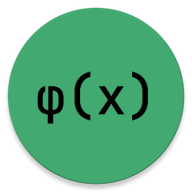

# Formulae App

An extremely simple app to write and share formulas, with zero permissions.

We have a two well-defined concepts in this project:

* Simple: the design may be ugly, but the idea is simple, write formulas and get images back (and possibly share)
* Should avoid third party dependencies: only the required androidx dependencies are used
* No ADS: no explanation needed, we all hate ads

## License

Licensed under GNU General Public License version 2. You may copy and distribute the code, but any addition must be under the same license.

You can get a full copy of the license at: https://gnu.org/licenses/old-licenses/gpl-2.0.txt
